# 🛡️ Secure EC2 Web Server — AWS SAA Portfolio Project


---

## 📌 Overview

A production-style, highly available web server built on AWS — demonstrating the core SAA pattern of a resilient, auto-scaling compute tier sitting behind a load balancer, deployed across multiple Availability Zones.

Built in two stages: first a hardened single EC2 instance (Phase 1), then upgraded to a full high-availability architecture with ALB, Auto Scaling Group, proper VPC, and SSM Session Manager replacing SSH entirely (Phase 2 — SAA upgrade).

The entire stack is reproducible via a single CloudFormation template.

---

## 🏗️ Architecture


> 📐 Built with eraser.io
---

## ☁️ AWS Services Used

| Service | Purpose | SAA Domain |
|---------|---------|-----------|
| Amazon VPC | Custom isolated network (not default VPC) | Secure |
| Public + Private Subnets | Proper network segmentation | Secure |
| Internet Gateway | VPC → internet connectivity | Networking |
| NAT Gateway | Private EC2 → internet outbound only | Secure |
| Application Load Balancer | Distributes HTTP across both AZs | Resilient |
| Auto Scaling Group | Automatically adds/removes EC2s on demand | Resilient |
| EC2 (t2.micro) | Nginx web servers in private subnets | Compute |
| Security Groups | Stateful instance-level firewall | Secure |
| IAM Role + Instance Profile | EC2 permissions via role (no hardcoded keys) | Secure |
| SSM Session Manager | SSH-free access — no open port 22 | Secure |
| CloudWatch Alarms | CPU monitoring + SNS email alert | Monitoring |
| Amazon SNS | Email notification on CPU alarm | Monitoring |
| EBS (gp3, encrypted) | Encrypted root volumes on all EC2s | Secure |
| AWS CloudFormation | Entire stack as Infrastructure as Code | IaC |
| AWS Boto3 (Python) | Automated status check script | Automation |

---

## 🔑 SAA Upgrade — What Changed and Why

### Phase 1 (original): Single EC2 in default VPC
The original project launched a single EC2 in the default VPC with a public IP. It worked, but had critical architectural weaknesses — no redundancy, direct internet exposure, and reliance on the AWS-managed default VPC.

### Phase 2 (SAA upgrade): High Availability Architecture

**Custom VPC with public/private subnets**
The default VPC is fine for learning but not acceptable for a portfolio at SAA level. A custom VPC demonstrates that you understand network design — public subnets for the load balancer, private subnets for the compute. EC2 instances have no public IPs and no direct internet exposure.

**Application Load Balancer**
Single EC2 = single point of failure. If the instance goes down, the site goes down. ALB distributes traffic across two EC2s in two different Availability Zones. If one AZ has an outage, the ALB stops sending traffic to it within seconds — the other AZ keeps serving.

**Auto Scaling Group**
ALB + ASG is the core SAA resilience pattern. The ASG maintains the desired number of healthy instances. If an EC2 fails its health check, ASG terminates it and launches a replacement automatically — zero manual intervention. When CPU exceeds 70%, ASG adds an instance. When load drops, it removes it. Cost-efficient and resilient simultaneously.

**SSM Session Manager (replacing SSH)**
SSH requires port 22 open and key files distributed to engineers. Both are security risks. SSM Session Manager uses IAM credentials — access is defined by IAM policies, every session is logged in CloudTrail, and port 22 is closed entirely. This is the AWS recommended approach and an increasingly common SAA exam answer.

---

## 🔒 Security Practices

| Practice | Implementation |
|----------|---------------|
| No public EC2 IPs | EC2s live in private subnets — unreachable from internet |
| No open port 22 | SSM Session Manager replaces SSH entirely |
| Security Group chaining | sg-app only accepts traffic from sg-alb (not from 0.0.0.0/0) |
| IAM Role (not keys) | EC2 uses instance profile — no hardcoded credentials anywhere |
| EBS encryption | All root volumes encrypted at rest using AWS managed key |
| NAT Gateway | Private EC2s can reach internet outbound — nothing reaches them inbound |
| CloudFormation | Infrastructure defined as code — auditable and reproducible |

---

## 📁 Repository Structure

```
aws-ec2-secure-webserver/
├── cloudformation/
│   └── ec2-ha-stack.yaml          # Full IaC — ALB + ASG + VPC
├── scripts/
│   └── check_ec2_status.py        # Boto3 status check script
├── README.md
├── Architecture-diagram.png
└── docs/
    ├── ss01-iam-user.png
    ├── ss02-iam-role.png
    ├── ss03-vpc-subnets.png
    ├── ss04-security-groups.png
    ├── ss05-ec2-running.png
    ├── ss06-alb-healthy-targets.png
    ├── ss07-asg-configured.png
    ├── ss08-nginx-browser.png
    ├── ss09-ssm-session.png
    ├── ss10-cloudwatch-alarm.png
    ├── ss11-sns-confirmed.png
    ├── ss12-boto3-output.png
    └── ss13-cloudformation-stack.png
```

---

## 🚀 Deploy with CloudFormation

```bash
# Deploy entire stack (VPC + ALB + ASG + EC2s)
aws cloudformation create-stack \
  --stack-name ec2-ha-webserver \
  --template-body file://cloudformation/ec2-ha-stack.yaml \
  --parameters \
    ParameterKey=MyIPAddress,ParameterValue=$(curl -s ifconfig.me)/32 \
    ParameterKey=NotificationEmail,ParameterValue=your@email.com \
  --capabilities CAPABILITY_NAMED_IAM \
  --region us-east-1

# Monitor stack progress
aws cloudformation describe-stacks \
  --stack-name ec2-ha-webserver \
  --query 'Stacks[0].StackStatus'

# Get the ALB URL to test
aws cloudformation describe-stacks \
  --stack-name ec2-ha-webserver \
  --query 'Stacks[0].Outputs[?OutputKey==`ALBDNSName`].OutputValue' \
  --output text

# Tear everything down when done (saves cost)
aws cloudformation delete-stack --stack-name ec2-ha-webserver
```

---

## 📸 Screenshots

| Screenshot | Description |
|------------|-------------|
| 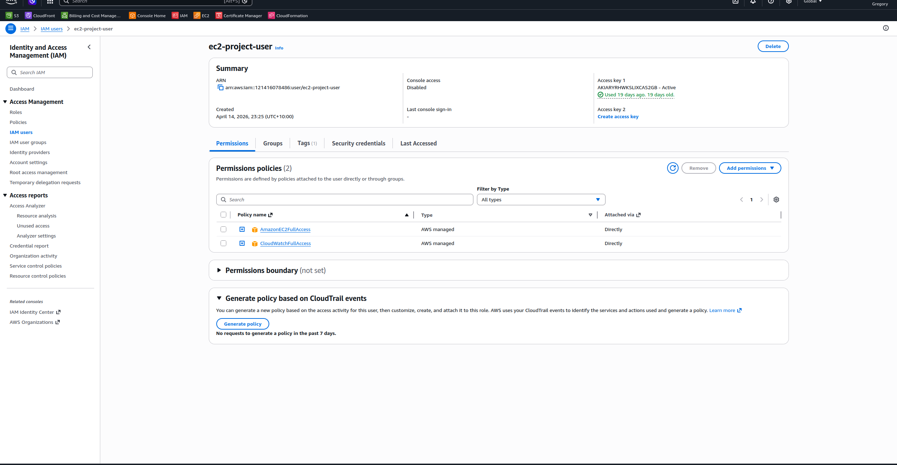 | **IAM User** — ec2-project-user with AmazonEC2FullAccess + CloudWatchFullAccess |
| 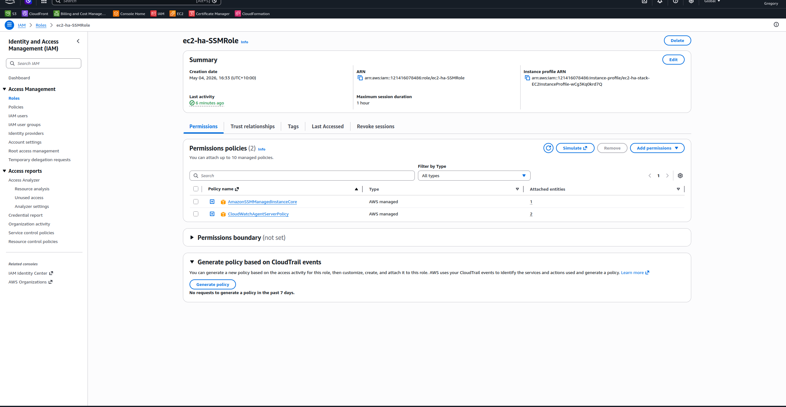 | **IAM Role** — ec2-cloudwatch-role with AmazonSSMManagedInstanceCore attached |
| 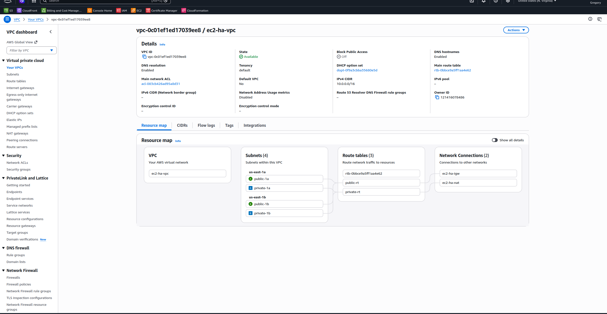 | **VPC + Subnets** — 4 subnets across 2 AZs (public + private) |
| 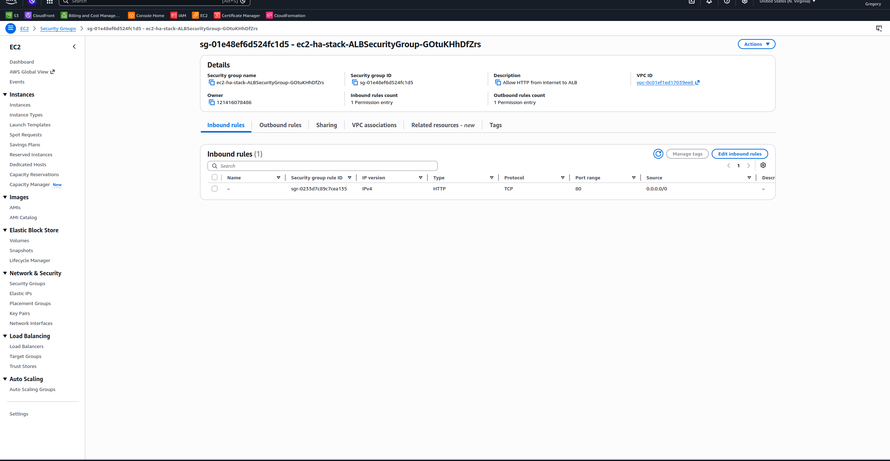 | **Security Group chaining** — sg-app inbound references sg-alb, not 0.0.0.0/0 |
| 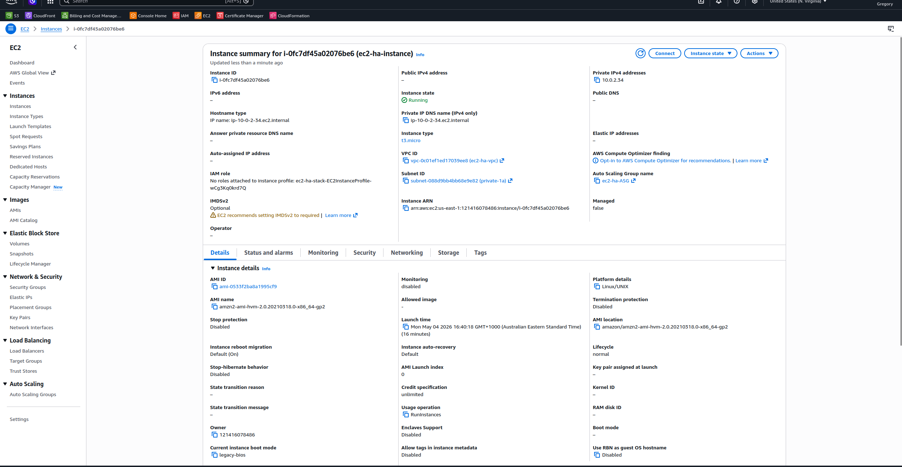 | **EC2 Instances** — 2 instances running, private IPs only, no public IPs |
| 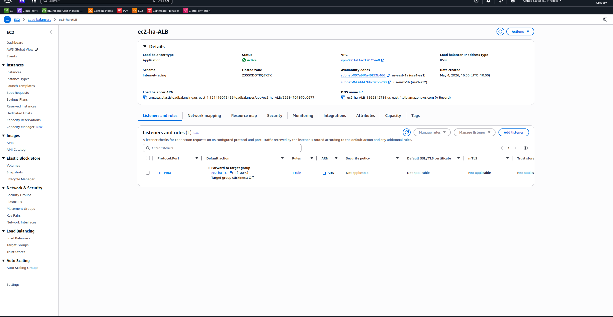 | **ALB Target Group** — both instances showing healthy ✅ |
| 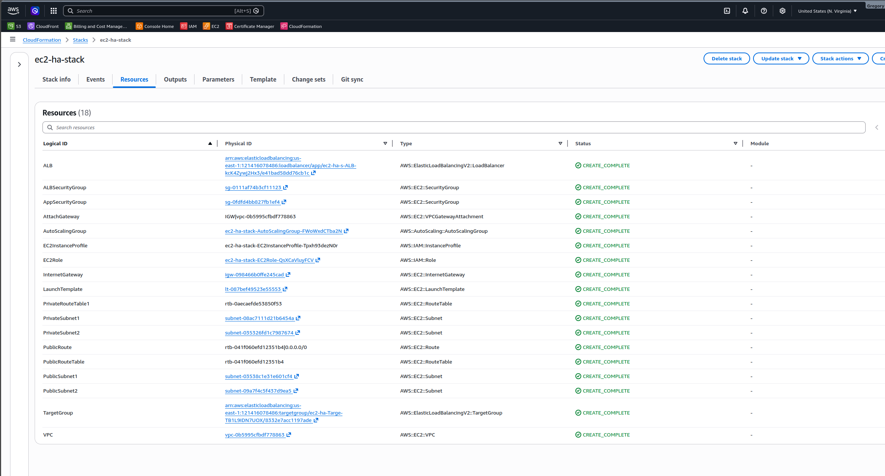 | **Auto Scaling Group** — min 1 / desired 2 / max 3, spanning both AZs |
| 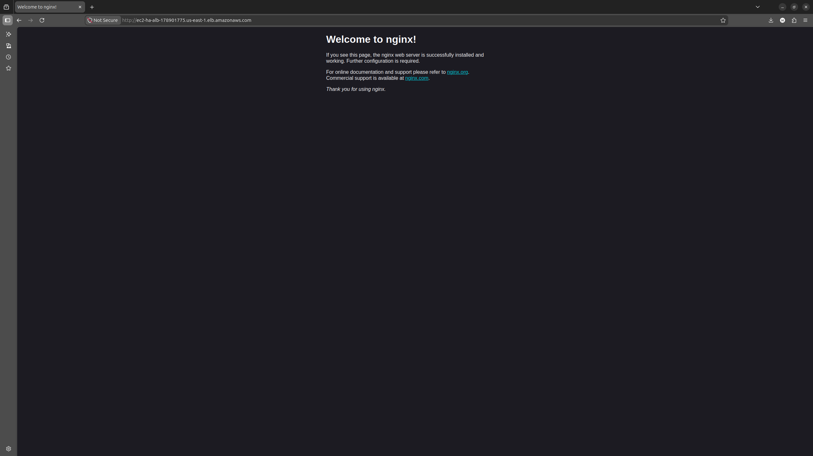 | **Nginx page** — loading via ALB DNS name in browser |
| 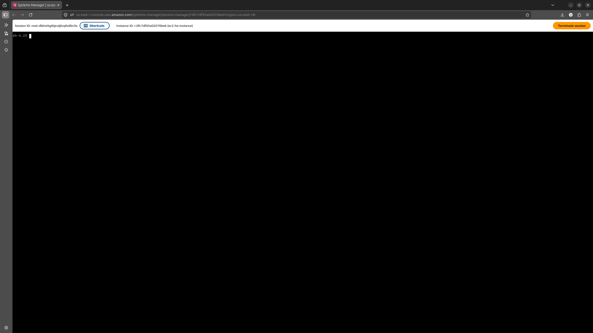 | **SSM Session Manager** — browser terminal, no SSH, no port 22 |
| 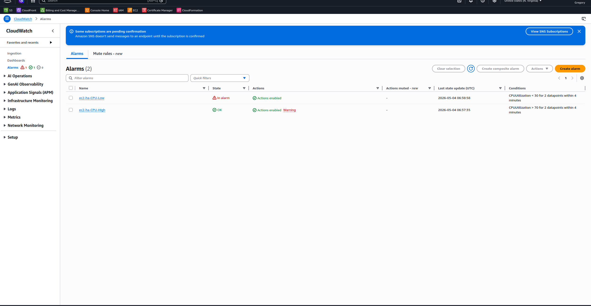 | **CloudWatch Alarm** — CPU > 70% configured, 2 evaluation periods |
|  | **SNS Subscription** — email endpoint confirmed ✅ |
| 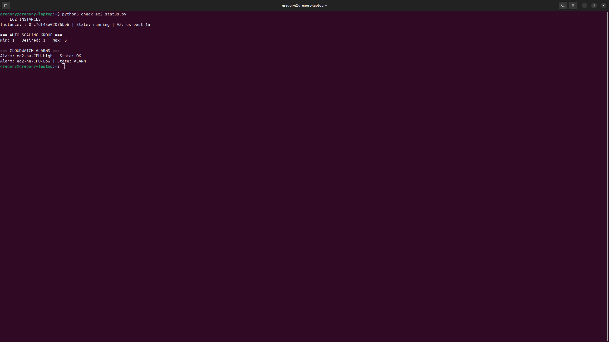 | **Boto3 Script** — EC2 state, alarm status, ASG capacity printed to terminal |

---

## 🧠 What I Learned — SAA Concepts

**High Availability fundamentals**
- Multi-AZ deployment ensures no single point of failure at the infrastructure level
- AZ failure is a real event — designing for it is not over-engineering
- ALB health checks detect unhealthy instances in seconds

**Auto Scaling**
- The difference between horizontal scaling (more instances) and vertical scaling (bigger instances)
- Why horizontal scaling is preferred: no downtime, gradual, cost-proportional
- Cooldown periods prevent ASG from over-reacting to brief CPU spikes

**Networking**
- Why EC2s belong in private subnets — attack surface reduction
- NAT Gateway pattern — outbound without inbound exposure
- Security Group chaining vs open IP ranges

**IAM and access**
- Instance profiles vs access keys — roles are always preferred
- SSM Session Manager as the modern replacement for SSH
- The principle of least privilege applied at every layer

**Infrastructure as Code**
- A CloudFormation template is living documentation
- Reproducible infrastructure eliminates "it works on my account" problems
- Drift detection catches manual changes that break your template

---

## ⚠️ Cost Management

| Resource | Free Tier | Action |
|----------|-----------|--------|
| EC2 t3.micro (×2) | 750hrs/month free | Stop when not using |
| ALB | 750hrs/month free | Delete after project |
| NAT Gateway | NOT free — ~$1/day | Delete after screenshots |
| CloudWatch alarms | 10 free | Fine to leave |
| SNS | 1M publishes free | Fine to leave |

**Fastest cleanup:** `aws cloudformation delete-stack --stack-name ec2-ha-webserver`
Deletes everything in reverse dependency order automatically.

---

## 👤 Author

**Gregory Suzan** — Cloud Engineer | AWS SAA Candidate | Ex-Graphic Designer
📍 Brisbane, Australia | [GitHub](https://github.com/GregorySuzan)
